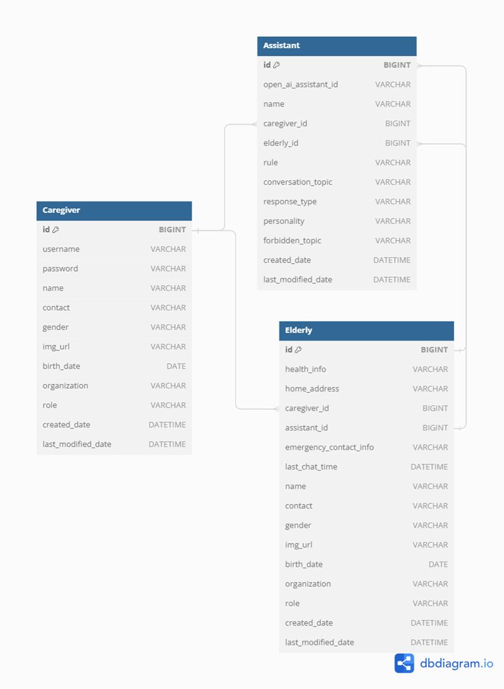

## ERD





## 작업
### FeignClient에서 WebClient로 일부 요청 이전
- 답변을 SSE 스트림으로 받기 위해 FeignClient에서 처리했던 메시지 생성 요청과 런 생성 요청을 WebClient로 이전
- 메시지 생성과 답변 생성을 체인으로 같이 묶어서 메시지 생성 후 런을 실행해 답변 추출 가능한 상태가 되면 스트림으로 반환
- 답변을 오디오로 반환하는 기능도 동일하게 진행


## 기록
### @SuperBuilder
- @Builder는 단일 클래스에 대한 빌더를 생성
- 공통 속성을 뽑아 User라는 추상 클래스로 만든 뒤, 상속으로 구성한 경우 부모 클래스 필드에는 빌더 패턴이 적용이 안된다
- 상속받은 부모 클래스의 필드까지 적용하기 위해서는 @SuperBuilder를 사용 -> 생성자에서 상속받은 필드도 빌더에서 사용 가능하게 된다
```text
The @SuperBuilder annotation produces complex builder APIs for your classes. 
In contrast to @Builder, @SuperBuilder also works with fields from superclasses. 
However, it only works for types. Most importantly, it requires that all superclasses also have the @SuperBuilder annotation.
```
- 부모와 자식 양쪽에 달아줘야 한다

### JSON 데이터 카멜 케이스로 받기
- @JsonProperty로 필드에 지정해줘도 되지만 필드가 너무 많을 경우,
- @JsonNaming(value = PropertyNamingStrategies.SnakeCaseStrategy.class) 사용해서 클래스 레벨에 걸어주기

### 에러 1: InternalAuthenticationServiceException
- JSON 데이터를 객체로 역직렬화 할 때 기본 생성자나 명시적으로 정의된 생성자(@JsonProperty)가 없을 때 발생
- ReqDto에 꼭 기본 생성자 부여하자

### 에러 2: InvalidDefinitionException
- Jakson이 직렬화할 수 있는 접근 가능한 필드나 게터가 없기 때문에 발생
- DTO의 private 필드에 대해서 Getter를 열어줘야 한다

### Swagger 설정
@Operation : endpoint에 대한 요약, 설명 등을 지정하는 용도로 사용. 컨트롤러 내 메서드에 사용
- operationId : endpoint 아이디
- summary : swagger-ui endpoint 상단에 노출되는 간단한 설명
- description : endpoint 상세 설명
- tags : 현재 endpoint가 속한 그룹 지정
- response : 응답 코드, 응답 타입 등 지정

@Parameter : 해당하는 endpoint의 파라미터 타입과 입력에 대한 설명 지정
- name : 파라미터 이름
- description : 파라미터 설명
- requried : 필수/선택 여부 (true이면 필수, false면 선택)
- in : 파라미터 타입 지정
  - ParameterIn.Query : 요청 쿼리 파라미터
  - ParameterIn.HEADER : 요청 헤더에 전달되는 파라미터
  - ParameterIn.PATH : PathVariable에 속하는 파라미터
  - 값없음 : RequestBody에 해당하는 객체 타입의 파라미터